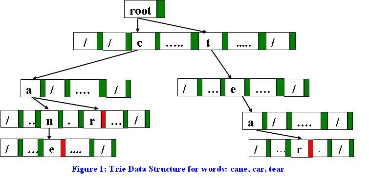

# INTRO

-  Efficient for the following operations on words in a dictionary:
   -  Search: Finding if a word exists in the dictionary.
   -  Insertion: Adding new words to the dictionary.
   -  Deletion: Removing words from the dictionary.
   - Prefix Search: Finding all words that start with a given prefix.
   - Lexicographical Order: Storing words in a way that allows for easy retrieval in alphabetical order.



## Implementation of a Trie:
```java
public class TrieNode {
    TrieNode[] children = new TrieNode[26]; // Assuming only lowercase English letters
    boolean isEndOfWord;
}

public class Trie {
    // Insert a word into the trie
    public void insert(String word, TrieNode root) {
        TrieNode currentNode = root;
        for (char c : word.toCharArray()) {
            int index = c - 'a'; // Map character to index (0-25)
            if (currentNode.children[index] == null) {
                currentNode.children[index] = new TrieNode();
            }
            currentNode = currentNode.children[index];
        }
        currentNode.isEndOfWord = true; // Mark the end of the word
    }

    // Search for a word in the trie
    public boolean search(String word, TrieNode root) {
        TrieNode currentNode = root;
        for (char c : word.toCharArray()) {
            int index = c - 'a';
            if (currentNode.children[index] == null) {
                return false; // Word does not exist
            }
            currentNode = currentNode.children[index];
        }
        return currentNode.isEndOfWord; // Check if it's the end of a valid word
    }
}
```

